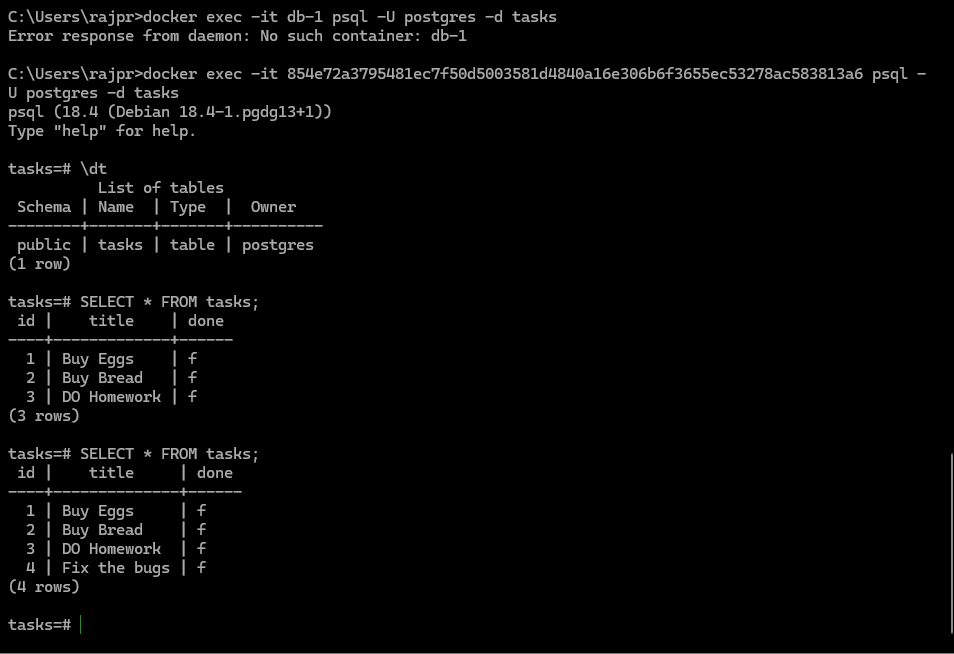

# FR-BE-03

This is a small Express + PostgreSQL task API. It exposes CRUD endpoints for tasks, seeds a few starter rows on startup, and serves Swagger docs at `/docs`.

## Run Everything

Start the API and database with one command:

```bash
docker compose up
```

## Environment

Set the variables shown in [.env.example](.env.example).

The app expects at least:

- `PORT`
- `DATABASE_URL`

## Endpoints

| Method | Path | Description |
| --- | --- | --- |
| GET | `/` | Basic service info |
| GET | `/health` | Health check |
| GET | `/docs` | Swagger UI |
| GET | `/tasks` | List all tasks |
| POST | `/tasks` | Create a task |
| GET | `/tasks/:id` | Get one task by id |
| PUT | `/tasks/:id` | Update a task's `done` state |

## Example Request

```bash
curl -i -X POST http://localhost:3000/tasks \
	-H "Content-Type: application/json" \
	-d '{"title":"Buy milk"}'
```


